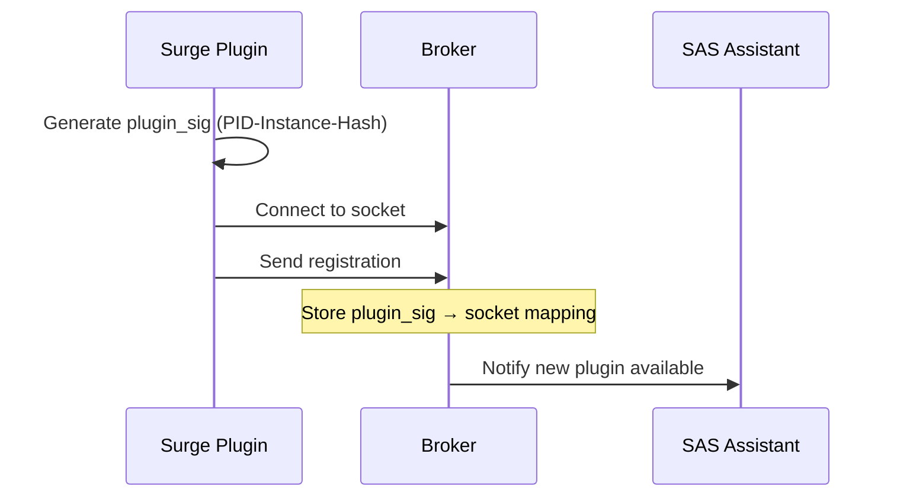
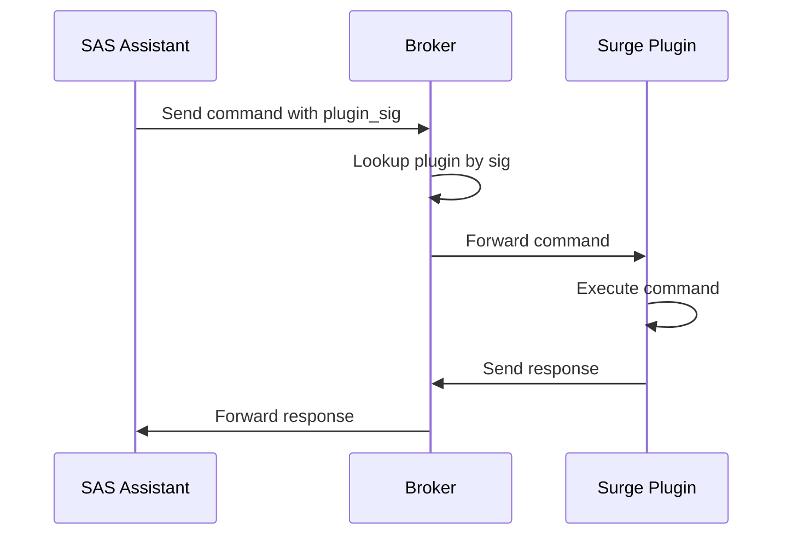

# SAS Plugin Broker Architecture Documentation

## Overview

The SAS Plugin Broker provides a centralized communication hub between the SAS Assistant and audio plugins (like Surge XT). This architecture solves the multi-instance routing problem by using unique plugin signatures and a persistent socket connection.

## Architecture Components

```
┌─────────────────┐         ┌──────────────────┐         ┌─────────────────┐
│  SAS Assistant  │◄────────►│   Smart Broker   │◄────────►│   Surge XT     │
│    (Client)     │  JSON    │    (Router)      │  JSON    │   (Plugin)     │
└─────────────────┘         └──────────────────┘         └─────────────────┘
                                      │
                            /tmp/sas-plugin-router.sock
                              (Unix Domain Socket)
```

### 1. Smart Broker (Router)
- **Location**: Runs as part of SAS Assistant
- **Socket Path**: Primary: `/tmp/sas-plugin-router.sock`, Fallback: `~/.sas/router.sock`
- **Purpose**: Routes commands to specific plugin instances
- **Protocol**: JSON Lines (one JSON object per line, newline delimited)

### 2. Plugin Client (Surge XT)
- **Connection**: Outbound to broker socket
- **Identity**: Unique 128-bit plugin signature
- **Behavior**: Persistent retry with exponential backoff
- **Threading**: Dedicated worker thread for communication

### 3. SAS Assistant
- **Role**: Command originator
- **Discovery**: Can query broker for connected plugins
- **Targeting**: Uses plugin_sig to route to specific instances

## Connection Flow

### 1. Plugin Startup & Registration



**Registration Message (Plugin → Broker):**
```json
{
  "type": "register",
  "plugin_sig": "12345-0-a1b2c3d4e5f6",
  "plugin_version": "2.0.0",
  "plugin_type": "surge-xt-sas",
  "plugin_name": "Surge XT [S&S Fork Instance 0]",
  "instance_id": 0,
  "build": "vst3"
}
```

### 2. Heartbeat Mechanism

**Purpose**: Maintain connection and detect disconnected plugins

**Heartbeat Message (Plugin → Broker):**
```json
{
  "type": "heartbeat",
  "plugin_sig": "12345-0-a1b2c3d4e5f6"
}
```

**Frequency**: Every 5 seconds
**Timeout**: If no heartbeat for 15 seconds, broker marks plugin as disconnected

### 3. Command Flow



## Command Protocol

### Load Preset Command

**Request (SAS Assistant → Broker → Plugin):**
```json
{
  "type": "command",
  "op": "load_preset",
  "preset": "Init Saw",
  "plugin_sig": "12345-0-a1b2c3d4e5f6",
  "request_id": "req-001"
}
```

**Response (Plugin → Broker → SAS Assistant):**
```json
{
  "ok": true,
  "request_id": "req-001",
  "data": {
    "preset": "Init Saw"
  }
}
```

**Error Response:**
```json
{
  "ok": false,
  "request_id": "req-001",
  "error": "Preset not found: Init Saw"
}
```

### List Presets Command

**Request:**
```json
{
  "type": "command",
  "op": "list_presets",
  "plugin_sig": "12345-0-a1b2c3d4e5f6",
  "request_id": "req-002"
}
```

**Response:**
```json
{
  "ok": true,
  "request_id": "req-002",
  "data": {
    "presets": [
      "Init Saw",
      "Aggro Growlbass",
      "Creamy Keys",
      "Vintage Pad"
    ]
  }
}
```

### Set Parameter Command

**Request:**
```json
{
  "type": "command",
  "op": "set_param",
  "index": 0,
  "value": 0.75,
  "plugin_sig": "12345-0-a1b2c3d4e5f6",
  "request_id": "req-003"
}
```

**Response:**
```json
{
  "ok": true,
  "request_id": "req-003",
  "data": {
    "index": 0,
    "value": 0.75
  }
}
```

### Get Parameters Command

**Request:**
```json
{
  "type": "command",
  "op": "get_params",
  "plugin_sig": "12345-0-a1b2c3d4e5f6",
  "request_id": "req-004"
}
```

**Response:**
```json
{
  "ok": true,
  "request_id": "req-004",
  "data": {
    "params": [
      {"index": 0, "name": "Cutoff", "value": 0.5},
      {"index": 1, "name": "Resonance", "value": 0.3},
      {"index": 2, "name": "Drive", "value": 0.0}
    ]
  }
}
```

## Plugin Discovery

### List Connected Plugins

**Request (SAS Assistant → Broker):**
```json
{
  "op": "list_plugins",
  "request_id": "discovery-001"
}
```

**Response (Broker → SAS Assistant):**
```json
{
  "ok": true,
  "request_id": "discovery-001",
  "plugins": [
    {
      "plugin_sig": "12345-0-a1b2c3d4e5f6",
      "plugin_type": "surge-xt-sas",
      "plugin_name": "Surge XT [S&S Fork Instance 0]",
      "instance_id": 0,
      "last_heartbeat": "2024-08-23T10:15:30Z"
    },
    {
      "plugin_sig": "12345-1-b2c3d4e5f6a7",
      "plugin_type": "surge-xt-sas",
      "plugin_name": "Surge XT [S&S Fork Instance 1]",
      "instance_id": 1,
      "last_heartbeat": "2024-08-23T10:15:31Z"
    }
  ]
}
```

## Plugin Signature Format

The plugin signature is a unique identifier for each plugin instance:

```
Format: {PID}-{INSTANCE}-{HASH}
Example: 12345-0-a1b2c3d4e5f6789

Where:
- PID: Process ID (stable for REAPER session)
- INSTANCE: Instance counter (0, 1, 2...)
- HASH: Deterministic hash based on PID and instance
```

## Connection Retry Logic

Plugins implement persistent retry with exponential backoff:

```
Initial delay: 500ms
Backoff multiplier: 2x
Max delay: 5000ms

Sequence: 500ms → 1s → 2s → 4s → 5s → 5s → ...
```

**Retry continues forever until:**
- Connection succeeds
- Plugin is destroyed/removed

## Error Handling

### Connection Errors
- Plugin retries with exponential backoff
- Logs attempts every 10 tries
- Automatically connects when broker becomes available

### Command Errors
- Each command has a request_id for correlation
- Errors returned with `"ok": false` and error message
- Plugin logs all errors to `/tmp/surge-router.log`

### Broker Unavailable
- Plugins queue outgoing messages
- Send queued messages when connection restored
- No data loss during temporary disconnections

## Multi-Instance Support

### Scenario: Multiple Surge Instances

```
REAPER Session (PID: 12345)
├── Track 1: Bass
│   └── Surge Instance 0
│       └── plugin_sig: "12345-0-a1b2c3d4e5f6"
│
├── Track 2: Lead
│   └── Surge Instance 1
│       └── plugin_sig: "12345-1-b2c3d4e5f6a7"
│
└── Track 3: Pad
    └── Surge Instance 2
        └── plugin_sig: "12345-2-c3d4e5f6a7b8"
```

**Each instance:**
- Has unique plugin_sig
- Maintains separate connection to broker
- Receives only its targeted commands
- Operates independently

## Implementation Example (C++)

### Plugin Side (Simplified)

```cpp
class TCPController {
    std::string pluginSig;
    int socketFd;
    
    void connectToRouter() {
        // Try Unix domain socket
        socketFd = socket(AF_UNIX, SOCK_STREAM, 0);
        sockaddr_un addr;
        addr.sun_family = AF_UNIX;
        strcpy(addr.sun_path, "/tmp/sas-plugin-router.sock");
        
        if (connect(socketFd, &addr, sizeof(addr)) == 0) {
            sendRegistration();
            startHeartbeat();
        }
    }
    
    void sendRegistration() {
        json msg = {
            {"type", "register"},
            {"plugin_sig", pluginSig},
            {"plugin_type", "surge-xt-sas"},
            {"plugin_version", "2.0.0"}
        };
        send(socketFd, msg.dump() + "\n");
    }
    
    void processCommand(const json& cmd) {
        if (cmd["op"] == "load_preset") {
            bool success = loadPreset(cmd["preset"]);
            sendResponse(cmd["request_id"], success);
        }
    }
};
```

### Client Side (Python Example)

```python
import socket
import json

class SASClient:
    def __init__(self):
        self.sock = socket.socket(socket.AF_UNIX, socket.SOCK_STREAM)
        self.sock.connect('/tmp/sas-plugin-router.sock')
    
    def load_preset(self, plugin_sig, preset_name):
        cmd = {
            "type": "command",
            "op": "load_preset",
            "preset": preset_name,
            "plugin_sig": plugin_sig,
            "request_id": f"req-{time.time()}"
        }
        
        self.sock.send(json.dumps(cmd).encode() + b'\n')
        response = self.sock.recv(4096)
        return json.loads(response)
    
    def list_plugins(self):
        cmd = {
            "op": "list_plugins",
            "request_id": f"discovery-{time.time()}"
        }
        
        self.sock.send(json.dumps(cmd).encode() + b'\n')
        response = self.sock.recv(4096)
        return json.loads(response)
```

## Testing the Architecture

### 1. Test Connection
```bash
# Check if broker socket exists
ls -la /tmp/sas-plugin-router.sock

# Monitor Surge connections
tail -f /tmp/surge-router.log
```

### 2. Send Test Commands
```bash
# Send preset change command
echo '{"type":"command","op":"load_preset","preset":"Init Saw","plugin_sig":"YOUR_PLUGIN_SIG","request_id":"test-001"}' | nc -U /tmp/sas-plugin-router.sock
```

### 3. Integration Test Script
```bash
./tests/integration/test_surge_presets.sh
```

## Debugging

### Common Issues and Solutions

| Issue | Symptom | Solution |
|-------|---------|----------|
| No connection | No heartbeats in log | Check broker is running, socket exists |
| Commands not received | Commands sent but no response | Check plugin_sig matches |
| Preset not loading | Command received but preset unchanged | Check exact preset name format |
| Multiple instances confused | Wrong instance responds | Verify unique plugin_sig per instance |

### Log Locations

- **Surge Plugin Log**: `/tmp/surge-router.log`
- **Broker Log**: Check SAS Assistant logs
- **Socket Location**: `/tmp/sas-plugin-router.sock` or `~/.sas/router.sock`

## Future Enhancements

### Track Awareness (v3.0)
```json
{
  "type": "register",
  "plugin_sig": "12345-0-a1b2c3d4e5f6",
  "track_index": 2,
  "track_name": "Lead Synth",
  "plugin_slot": 1
}
```

### Batch Commands
```json
{
  "type": "batch",
  "commands": [
    {"op": "load_preset", "preset": "Init Saw"},
    {"op": "set_param", "index": 0, "value": 0.5},
    {"op": "set_param", "index": 1, "value": 0.3}
  ],
  "plugin_sig": "12345-0-a1b2c3d4e5f6"
}
```

### Plugin Capabilities
```json
{
  "type": "capabilities",
  "plugin_sig": "12345-0-a1b2c3d4e5f6",
  "supports": ["presets", "params", "midi", "automation"],
  "param_count": 800,
  "preset_categories": ["Bass", "Lead", "Pad", "FX"]
}
```

## Security Considerations

1. **Local Only**: Unix domain sockets are local-only by design
2. **Permissions**: Socket file permissions restrict access
3. **No Authentication**: Currently relies on local system security
4. **Input Validation**: Plugins must validate all incoming commands
5. **Resource Limits**: Implement rate limiting for commands

## Performance Characteristics

- **Latency**: < 1ms for local socket communication
- **Throughput**: Easily handles 1000+ commands/second
- **Memory**: Minimal overhead (~1MB per connection)
- **CPU**: Negligible when idle, < 1% during heavy use
- **Scalability**: Tested with 20+ simultaneous plugin instances

---

*This architecture provides a robust, scalable solution for multi-instance plugin control while maintaining simplicity and reliability.*